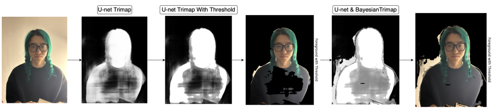
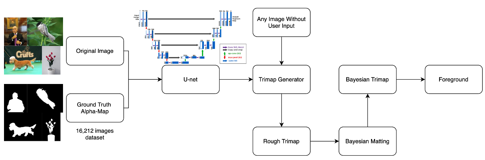
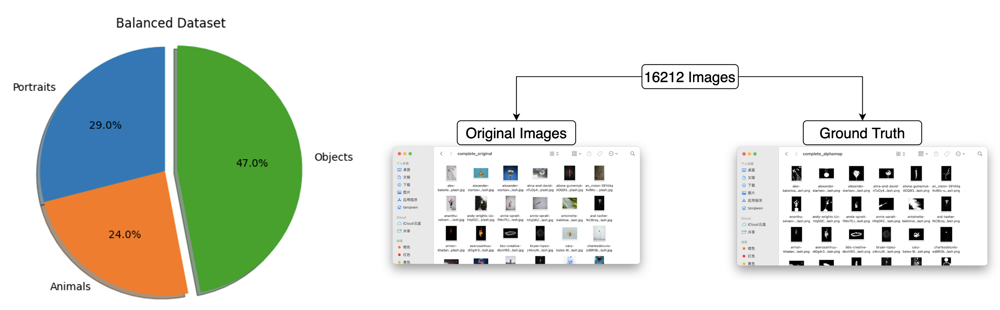

# DeepMatte-Bayesian

## Overview
This project is the final project for the MSc Computational Methods course at Trinity College Dublin (TCD). 

It utilizes a Bayesian matting algorithm to separate the foreground and background of images. Traditional Bayesian matting methods require initial user input to define rough foreground and background regions before computation. However, this project innovatively trains a U-Net model with a sigmoid activation function in the output layer to produce a smooth trimap, thereby eliminating the need for user input.

In addition, the project includes the creation of a balanced dataset comprising 16,212 images with ground truth data. The dataset is composed of 29% portraits, 24% animals, and 47% objects, ensuring that the model can be applied to various types of images.

## Features
- Uses a Bayesian algorithm for image matting.
- Innovatively trains a U-Net model to automatically generate trimaps without user input.
- Provides a balanced dataset for training, featuring a diverse range of image categories.
- Outputs smooth and precise alpha maps suitable for multiple use cases.

## Dataset
The dataset used for training contains:
- 29% Portraits
- 24% Animals
- 47% Objects

The dataset has been balanced to ensure that the model can generalize well across different types of images.

## U-Net Model Architecture
The U-Net model used in this project consists of:
- Double convolution blocks for feature extraction.
- Downsampling blocks to capture spatial hierarchies.
- Upsampling blocks for precise localization.
- Output layer with a sigmoid activation function to generate smooth alpha maps.
